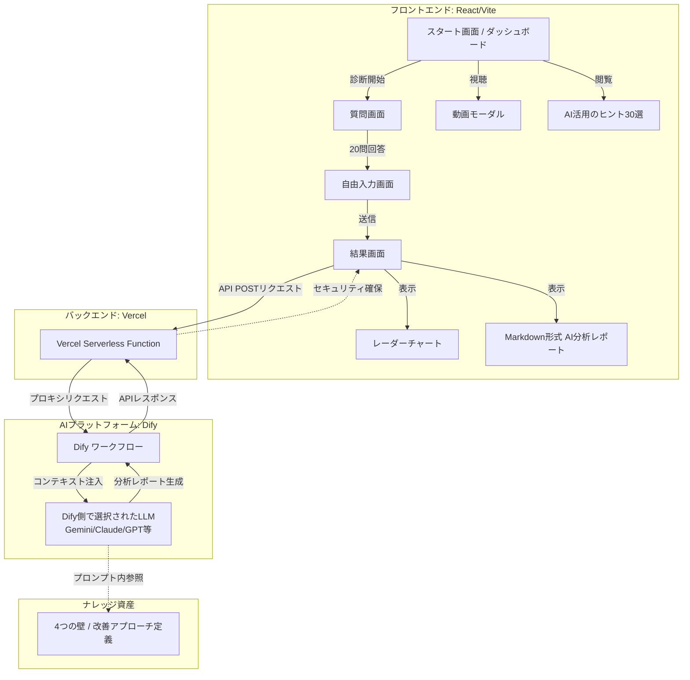

# AI活用・業務リデザイン変革支援ツール

> 組織のAI活用成熟度を可視化し、具体的な改善提案を提供するMBTI風変革支援ツール

[](https://ai-redesign-diagnostic.vercel.app)
[](https://react.dev)
[](https://www.typescriptlang.org/)

## 🎯 プロジェクト概要

組織のAI活用成熟度を可視化し、具体的な改善提案を提供するMBTI風変革支援ツール。診断結果に基づき、Dify経由で選択されたLLMによるAI分析で、具体的な改善ロードマップを提供します。

### 🌐 デモ

**本番環境**: [https://ai-redesign-diagnostic.vercel.app](https://ai-redesign-diagnostic.vercel.app)

---

## ✨ 主要機能

### 1. MBTI風の診断UX
- 6段階リッカート尺度（1=全くそう思わない 〜 6=とてもそう思う）
- 全20問の質問セット（各軸5問ずつ）
- スムーズなアニメーション（Framer Motion）
- 回答後の自動進行

### 2. 4軸スコアリング
- **自分の壁（内側）**: 心理的抵抗、目的理解、自己効力感、学習余白、オーナーシップ
- **資源の壁（内側）**: 時間、ツール環境、予算、スキル・人材、運用体制
- **他者の壁（外側）**: 顧客信頼、ステークホルダー巻き込み、外部ネットワーク、サポート体制、外部評価
- **環境の壁（外側）**: 制度、経済変動、社会・倫理、失敗許容文化、変化対応

### 3. レーダーチャート可視化
- Chart.jsによる4軸レーダーチャート
- ボトルネック軸の自動判定
- 各軸のスコア表示（1.0〜5.0）

### 4. AI分析レポート
- Dify API + LLMによる自動分析
- Markdown形式の詳細レポート
  - ボトルネックの深掘り分析
  - 短期・中長期アクションプラン
  - 専門家からのアドバイス
- カスタムCSSによるMarkdownスタイリング

---

## 🛠️ 技術スタック

### Frontend
- **Framework**: React 18.3 + Vite 5.4
- **Language**: TypeScript 5.5
- **Styling**: Tailwind CSS 3.4
- **Animation**: Framer Motion 11.x
- **Charts**: Chart.js 4.5 + react-chartjs-2 5.3
- **Markdown**: react-markdown 9.0

### Backend
- **Serverless**: Vercel Functions (Node.js)
- **API Proxy**: `/api/analyze` エンドポイント（CORS回避 + セキュリティ）

### AI
- **Platform**: Dify Cloud (Workflow)
- **LLM**: Dify上で選択可能（Gemini, Claude, GPT-4等）
- **Analysis**: 4軸スコア + ボトルネック軸 + 低スコア質問を送信

### Deployment
- **Hosting**: Vercel
- **CI/CD**: Git push → 自動デプロイ
- **Environment Variables**: `DIFY_API_KEY`, `DIFY_API_URL`

---

## 🚀 セットアップ

### 前提条件
- Node.js 20.x（推奨: nvs で管理）
- Dify アカウント + APIキー
- Vercel アカウント（デプロイ時）

### 1. リポジトリのクローン

```bash
git clone https://github.com/kimura-star-system/ai-redesign-diagnostic.git
cd ai-redesign-diagnostic
```

### 2. 依存パッケージのインストール

```powershell
# nvsでNode.js 20を使用
$env:PATH += ";$env:LOCALAPPDATA\nvs"
nvs use 20

# パッケージインストール
npm install
```

### 3. 環境変数の設定

プロジェクトルートに `.env.local` を作成（Gitには含めない）:

```env
DIFY_API_KEY=app-xxxxxxxxxxxxxxxxxxxxx
DIFY_API_URL=https://api.dify.ai/v1/workflows/run
```

### 4. ローカル開発サーバー起動

```powershell
```powershell
npm run dev
```

→ http://localhost:5173 でアクセス

### 5. ビルド（本番環境）

```powershell
npm run build
npm run preview  # ビルド結果のプレビュー
```

---

## 📦 プロジェクト構造

```
ai-redesign-diagnostic/
├── api/
│   └── analyze.ts              # Vercel Serverless Function (Dify API Proxy)
├── src/
│   ├── components/
│   │   ├── StartScreen.tsx     # スタート画面
│   │   ├── QuestionScreen.tsx  # 質問画面（20問）
│   │   ├── RadarChart.tsx      # レーダーチャート
│   │   └── ResultScreen.tsx    # 結果画面（AI分析表示）
│   ├── data/
│   │   └── questions.json      # 質問データ（20問 × 4軸）
│   ├── services/
│   │   └── difyApi.ts          # Dify API クライアント
│   ├── utils/
│   │   └── scoreCalculator.ts  # スコア計算・ボトルネック判定
│   ├── App.tsx                 # メインコンポーネント
│   └── main.tsx                # エントリーポイント
├── DIFY_PROMPT.md              # Dify SYSTEM プロンプト
├── VERCEL_DEPLOY.md            # デプロイ手順
├── package.json
└── README.md                   # このファイル
```

---

## 🔧 Dify ワークフロー設定

### 1. ワークフロー構成

```
Start → LLM (Selectable) → End
```

**⚠️ 重要**: Knowledge Retrieval ノードは削除してください（RPM制限回避のため）

### 2. 入力変数（Start ノード）

| 変数名 | 型 | 説明 | 最大長 |
|--------|-----|------|--------|
| `human_internal` | Text | 自分の壁のスコア（1.0-5.0） | 256 |
| `resource_internal` | Text | 資源の壁のスコア（1.0-5.0） | 256 |
| `human_external` | Text | 他者の壁のスコア（1.0-5.0） | 256 |
| `environment_external` | Text | 環境の壁のスコア（1.0-5.0） | 256 |
| `bottleneck_axis` | Text | ボトルネック軸名（日本語） | 256 |
| `lowest_questions` | Text | 低スコア質問（例：Q2(1.0), Q10(1.8)） | **2000** |

### 3. LLM ノードの SYSTEM プロンプト

[DIFY_PROMPT.md](./DIFY_PROMPT.md) の内容をそのままコピーしてください。

### 4. 出力変数（End ノード）

- `text`: LLMからのMarkdown形式のレポート

### 5. ワークフロー公開

設定完了後、画面右上の **「公開（Publish）」→「更新（Update）」** をクリックして、APIサーバー側に反映してください。

---

## 🌐 Vercel デプロイ

詳細は [VERCEL_DEPLOY.md](./VERCEL_DEPLOY.md) を参照してください。

### 簡易手順

1. **Vercel プロジェクト作成**
   - https://vercel.com/new
   - GitHub リポジトリを選択

2. **環境変数の設定**
   - `DIFY_API_KEY`: Dify APIキー
   - `DIFY_API_URL`: `https://api.dify.ai/v1/workflows/run`

3. **デプロイ**
   ```bash
   git add .
   git commit -m "Update"
   git push
   ```
   → Vercelが自動デプロイ（約1分）

---

## 📚 開発ドキュメント

### 主要ファイル解説

#### `api/analyze.ts`
- Vercel Serverless Function
- CORS ヘッダー設定（`Access-Control-Allow-Origin: *`）
- Dify API へのプロキシ（APIキーをサーバー側で管理）
- エラーハンドリング（RPM制限、400エラーなど）

#### `src/services/difyApi.ts`
- `USE_MOCK_DATA` フラグ（開発/本番切り替え）
- `analyzeDiagnostic()`: スコア + ボトルネック + 低スコア質問を送信
- `getMockAnalysis()`: ダミーデータ（開発用）

#### `src/utils/scoreCalculator.ts`
- `calculateScores()`: 6段階 → 5段階 正規化
- `getBottleneckAxis()`: 最低スコア軸の判定
- `getLowestQuestions()`: 各軸の最低質問抽出（`Q2(1.0), Q10(1.8)` 形式）

#### `src/components/ResultScreen.tsx`
- `useRef(false)` で API 複数回呼び出し防止
- `useEffect` で初回のみ分析実行
- カスタムCSSで Markdown スタイリング（h2下線、h3背景色、h4カード風）

### アーキテクチャ



```
React Frontend
    ↓ (POST /api/analyze)
Vercel API Route (api/analyze.ts)
    ↓ (Authorization: Bearer <DIFY_API_KEY>)
Dify API (Workflow)
    ↓ (Selectable LLM)
AI分析結果（Markdown）
    ↓
React Frontend (react-markdown で表示)
```

---

## ⚠️ 使用上の注意

### Dify無料プランの制限

このツールは **Dify Cloud 無料プラン（200クレジット/月）** を使用しています。

- **月間利用可能回数**: 約20〜30回の診断分析（Gemini 1.5 Flashの消費量による）
- **制限到達時の動作**: AI分析が実行できなくなります（スコア計算とレーダーチャートは表示されます）
- **リセットタイミング**: 毎月1日午前0時（UTC）

### 制限到達時の対処法

1. **翌月まで待つ**（無料プランの場合）
2. **Dify有料プランへアップグレード**
   - Pro: $59/月（5,000クレジット）
   - Team: $159/月（無制限）
3. **自前のGemini API Key使用**
   - Google AI Studio で無料API Keyを取得
   - Difyワークフローで自前のAPIキーに切り替え

### 推奨運用

- **デモ/プレゼン前に残りクレジットを確認**（Difyダッシュボード）
- **重要な診断は月初に実施**
- **テストはMOCK_DATAモードを使用**（`src/services/difyApi.ts`で`USE_MOCK_DATA = true`）

---

## 🐛 トラブルシューティング

### Q1: Dify API で 400 エラー（256文字制限）

**原因**: `lowest_questions` 変数の最大長が256に設定されている

**解決方法**:
1. Dify ワークフローの Start ノードを開く
2. `lowest_questions` 変数の「最大長さ」を `2000` に変更
3. **「公開」→「更新」** をクリック（これを忘れると反映されません）

### Q2: Gemini RPM 制限エラー（retryDelay: 24s）

**原因**: Knowledge Retrieval ノードが複数回 API を呼び出している

**解決方法**:
- Dify ワークフローから Knowledge Retrieval ノードを削除
- LLM ノードの SYSTEM プロンプトに [DIFY_PROMPT.md](./DIFY_PROMPT.md) を直接埋め込む

### Q3: API が複数回呼ばれる（React Strict Mode）

**解決済み**: `ResultScreen.tsx` で `useRef(false)` を使用して防止済み

---

## 📝 今後の改善案

- [ ] bottleneck_axis の日本語表記を統一（`human_external` → `他者（外側）`）
- [ ] 結果のPDFエクスポート機能
- [ ] 診断結果の履歴保存（LocalStorage or DB）
- [ ] 英語版の国際化対応
- [ ] 管理画面（診断データの集計・分析）
- [ ] Gemini 1.5 Flash 以外のLLM対応（Claude, GPT-4oなど）

---

## 📄 ライセンス

MIT License

---

## 👤 作成者

**GitHub**: [kimura-star-system](https://github.com/kimura-star-system)  
**Repository**: [ai-redesign-diagnostic](https://github.com/kimura-star-system/ai-redesign-diagnostic)

---

## 🙏 謝辞

- [Dify](https://dify.ai/) - AI Workflow Platform
- [Vercel](https://vercel.com/) - Deployment & Serverless Functions
- [Tailwind CSS](https://tailwindcss.com/) - Utility-first CSS Framework
- [Framer Motion](https://www.framer.com/motion/) - Animation Library
- [Chart.js](https://www.chartjs.org/) - Data Visualization
const DIFY_API_URL = 'https://api.dify.ai/v1/workflows/run';
const DIFY_API_KEY = 'app-xxxxxxxxxxxxxxxxxxxxxxxxxxxxx';
```

## プロジェクト構造

```
ai-redesign-diagnostic/
├── src/
│   ├── components/      # Reactコンポーネント
│   │   ├── StartScreen.tsx      # 開始画面
│   │   ├── QuestionScreen.tsx   # 質問画面
│   │   ├── RadarChart.tsx       # レーダーチャート
│   │   └── ResultScreen.tsx     # 結果画面
│   ├── data/
│   │   └── questions.json       # 質問データ（20問）
│   ├── services/
│   │   └── difyApi.ts          # Dify API連携
│   ├── utils/
│   │   └── scoreCalculator.ts  # スコア計算ロジック
│   ├── App.tsx          # メインアプリ
│   └── main.tsx         # エントリーポイント
├── package.json
└── vite.config.ts
```

## 主な機能

1. **スタート画面**: 診断の説明と開始ボタン
2. **質問画面**: 20問の質問に5段階で回答
3. **結果画面**: 
   - 4軸のレーダーチャート表示
   - スコア詳細
   - AIによる分析と改善提案
   - 結果の印刷機能

## トラブルシューティング

### Node.jsのバージョンが古い場合
```powershell
# 現在のバージョンを確認
node --version

# v20以上でない場合
nvs add 20
nvs use 20
```

### nvsコマンドが見つからない場合
```powershell
# 環境変数にnvsのパスを追加
$env:PATH += ";$env:LOCALAPPDATA\nvs"
```

## 次のステップ（本番デプロイ）

開発が完了したら、Vercelにデプロイします。詳細は親ディレクトリの `Dify実装手順.md` の「フェーズ5」を参照してください。

    },
  },
])
```
