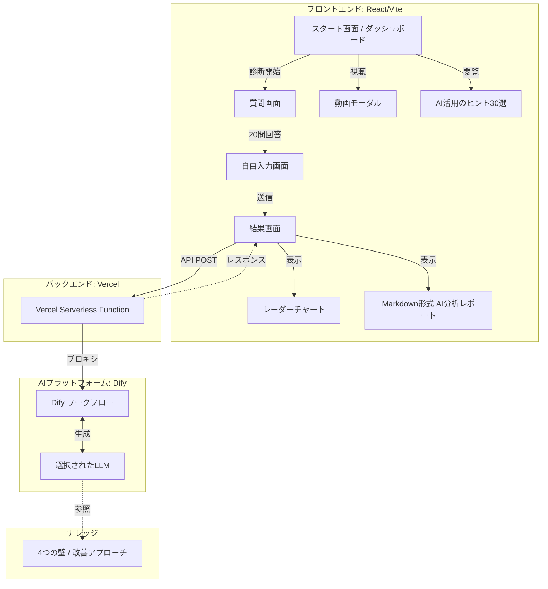

# AI活用・業務リデザイン変革支援ツール

> 組織のAI活用成熟度を可視化し、具体的な改善提案を提供するMBTI風変革支援ツール

[](https://ai-redesign-diagnostic.vercel.app)
[](https://react.dev)
[](https://www.typescriptlang.org/)

## 🎯 プロジェクト概要

組織における「AI活用」と「業務リデザイン」の成熟度を診断し、**4つの壁**（自分・資源・他者・環境）から課題を可視化します。診断結果に基づき、Dify経由のLLMがパーソナライズされた改善ロードマップを提供します。

### 🌐 デモ

**👉 [https://ai-redesign-diagnostic.vercel.app](https://ai-redesign-diagnostic.vercel.app)**

---

## ✨ 主要機能

| 機能 | 説明 |
|------|------|
| **MBTI風診断UX** | 6段階尺度 × 20問、スムーズなアニメーション |
| **4軸スコアリング** | 自分の壁・資源の壁・他者の壁・環境の壁 |
| **レーダーチャート** | Chart.jsによる可視化、ボトルネック自動判定 |
| **AI分析レポート** | Dify + LLMによるMarkdown形式の詳細分析 |

---

## 🛠️ 技術スタック

| カテゴリ | 技術 |
|----------|------|
| **Frontend** | React 18.3 + Vite 5.4 + TypeScript 5.5 |
| **Styling** | Tailwind CSS 3.4 + Framer Motion 11.x |
| **Charts** | Chart.js 4.5 + react-chartjs-2 |
| **Backend** | Vercel Functions (Node.js) |
| **AI** | Dify Cloud (Workflow) + 選択可能なLLM |

---

## 📐 アーキテクチャ



---

## 🚀 セットアップ

### 前提条件

- Node.js 20.x
- Dify アカウント + APIキー
- Vercel アカウント（デプロイ時）

### クイックスタート

```bash
# 1. クローン
git clone https://github.com/kimura-star-system/ai-redesign-diagnostic.git
cd ai-redesign-diagnostic

# 2. 依存パッケージインストール
npm install

# 3. 環境変数設定（.env.local を作成）
echo "DIFY_API_KEY=app-xxxxxxxxxx" > .env.local
echo "DIFY_API_URL=https://api.dify.ai/v1/workflows/run" >> .env.local

# 4. 開発サーバー起動
npm run dev
```

→ http://localhost:5173 でアクセス

---

## 📦 プロジェクト構造

```
ai-redesign-diagnostic/
├── api/
│   └── analyze.ts              # Vercel Serverless Function
├── src/
│   ├── components/
│   │   ├── StartScreen.tsx     # ダッシュボード
│   │   ├── QuestionScreen.tsx  # 質問画面（20問）
│   │   ├── FreeInputScreen.tsx # 自由入力
│   │   ├── ResultScreen.tsx    # 結果画面
│   │   ├── RadarChart.tsx      # レーダーチャート
│   │   └── VideoModal.tsx      # 動画モーダル
│   ├── data/
│   │   └── questions.json      # 質問データ
│   ├── services/
│   │   └── difyApi.ts          # Dify API クライアント
│   └── utils/
│       └── scoreCalculator.ts  # スコア計算
├── kb/                         # ナレッジベース（4つの壁）
├── dsl/                        # Dify DSL定義
├── DIFY_PROMPT.md              # LLM用プロンプト
└── VERCEL_DEPLOY.md            # デプロイ手順
```

---

## 🔧 Dify ワークフロー設定

詳細は [DIFY_PROMPT.md](./DIFY_PROMPT.md) を参照してください。

### 入力変数

| 変数名 | 説明 |
|--------|------|
| `human_internal` | 自分の壁スコア (1.0-5.0) |
| `resource_internal` | 資源の壁スコア (1.0-5.0) |
| `human_external` | 他者の壁スコア (1.0-5.0) |
| `environment_external` | 環境の壁スコア (1.0-5.0) |
| `bottleneck_axis` | ボトルネック軸名 |
| `lowest_questions` | 低スコア質問 (最大長: 2000) |

---

## 🌐 Vercel デプロイ

詳細は [VERCEL_DEPLOY.md](./VERCEL_DEPLOY.md) を参照してください。

```bash
# 環境変数を設定後
git push origin main
# → Vercelが自動デプロイ
```

---

## 📝 今後の改善案

- [ ] 結果のPDFエクスポート機能
- [ ] 診断結果の履歴保存
- [ ] 英語版の国際化対応
- [ ] 管理画面（診断データの集計）

---

## 📄 ライセンス

MIT License

---

## 👤 作成者

**GitHub**: [kimura-star-system](https://github.com/kimura-star-system)

## 🙏 謝辞

- [Dify](https://dify.ai/) - AI Workflow Platform
- [Vercel](https://vercel.com/) - Deployment & Serverless Functions
- [Tailwind CSS](https://tailwindcss.com/) - Utility-first CSS Framework
- [Framer Motion](https://www.framer.com/motion/) - Animation Library
- [Chart.js](https://www.chartjs.org/) - Data Visualization
